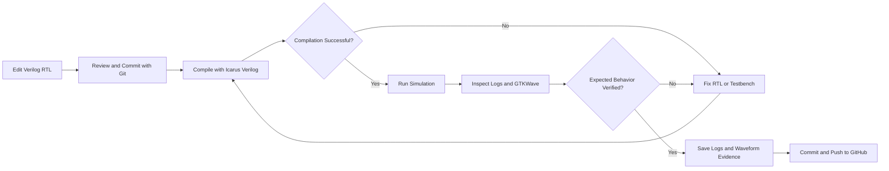

```mermaid
flowchart LR
    A[Edit Verilog RTL] --> B[Review and Commit with Git]
    B --> C[Compile with Icarus Verilog]
    C --> D{Compilation Successful?}
    D -- No --> E[Fix RTL or Testbench]
    E --> C
    D -- Yes --> F[Run Simulation]
    F --> G[Inspect Logs and GTKWave]
    G --> H{Expected Behavior Verified?}
    H -- No --> E
    H -- Yes --> I[Save Logs and Waveform Evidence]
    I --> J[Commit and Push to GitHub]
```